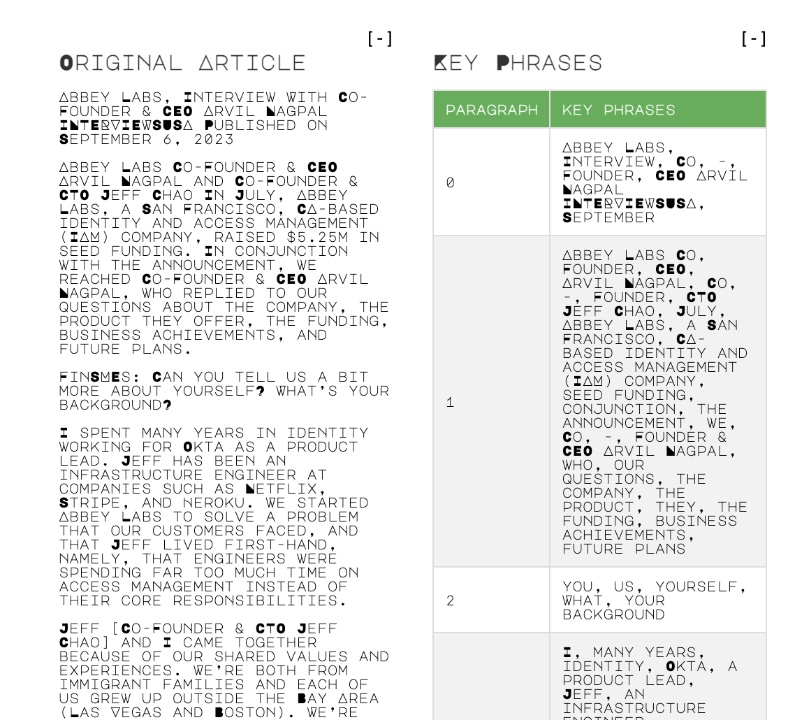
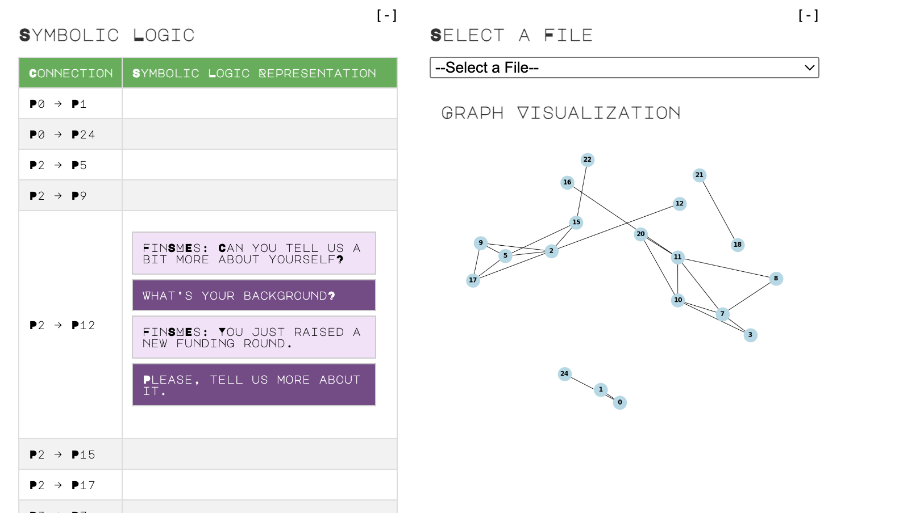
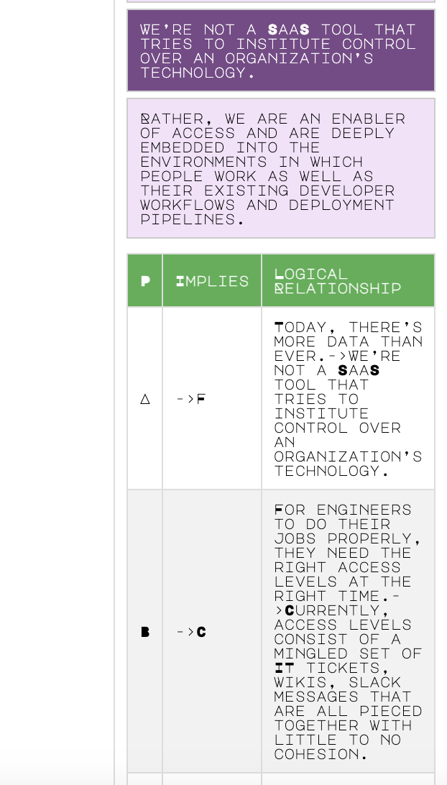

# lexical-to-symbolic-logic-engine
I needed to write some PR articles for myself. I am not a writer, but I am a computer scientist. So I procrastinated by creating a lexical-to-symbolic logic analyzer, to understand well written articles in English, and visualize it in the form of a graph, and symbolic logic relationships.

## cool graphs

| Image 1 | Image 2 | Image 3 |
|---------|---------|---------|
|  |  |  |
|  |  |  |
|  |  |  |

